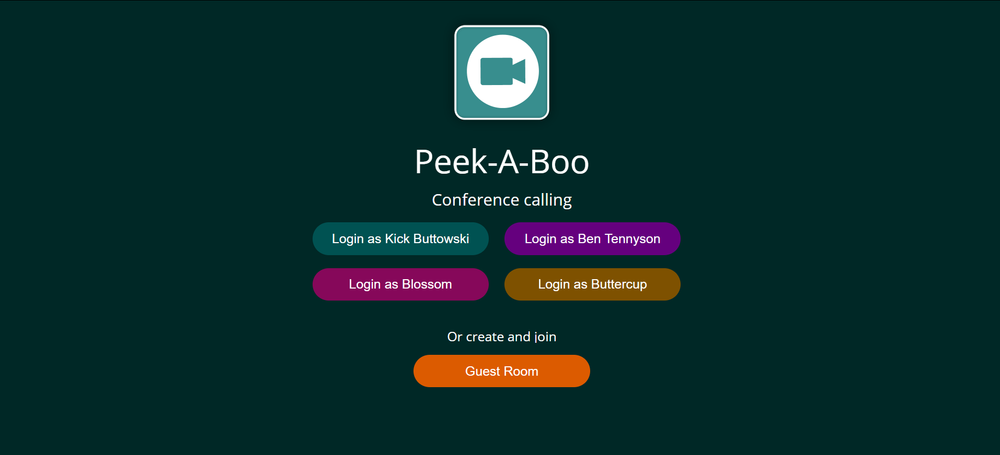
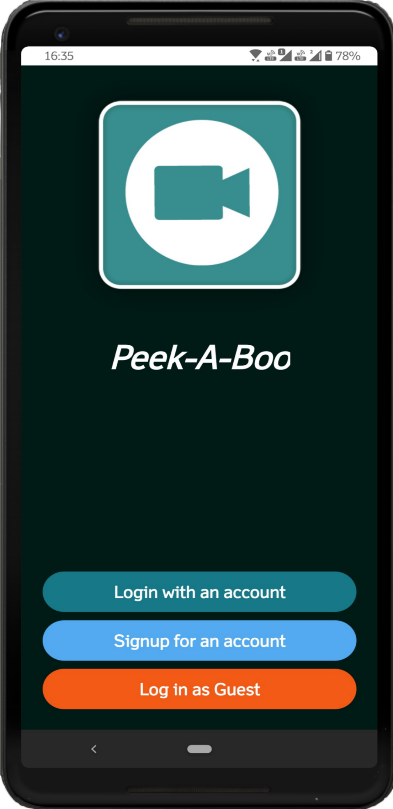
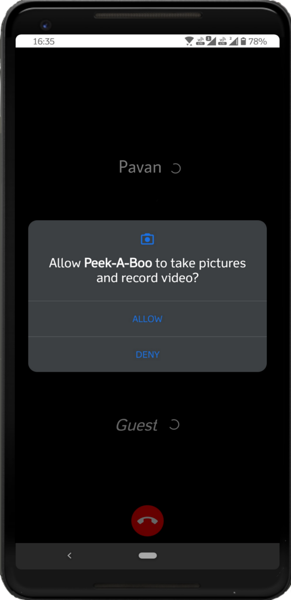

# Peek-A-Boo
## -- A Video Conferencing WebApp.

The Peek-A-Boo Video Conferencing app is built as a web clone version for the Peek-A-Boo android App.

## [Live demo](https://peek-a-boo.pavanaditya.com "Peek-a-boo")

This is Video Conference Calling app built using React Native and [ConnectyCube](https://connectycube.com) Open Source Apis.

Project contains the following features implemented:

- User authorization
- Video calls up to 4 users
- Mute/unmute microphone
- Mute/unmute video
- Switch camera
- Snack bars to notify users about changes
- Guest room mode up supports to 12 users

The sample provides 2 mods:
  - Calling mode, with call/accept/reject signals
  - Guest Room mode, where any user can join a call by link. To create a guest room you can click on a 'Guest Room' button and then share an url with other users. 

## Screenshots (Web app)

<p></p>
<p></p>
<p></p>

## Screenshots (Mobile app)

<p></p>
<p></p>

## Build your own VideoChat app

To make the sample works for your own app, please do the following:

1.  Register new account and application at `https://admin.connectycube.com` and then put Application credentials from 'Overview' page into `videochat-conf/src/config.js` file:

    ```javascript
    const credentials = {
      appId: 0,
      authKey: "",
      authSecret: ""
    };
    ```

2.  At `https://admin.connectycube.com`, create from 2 to 4 users in 'Users' module and put them into `videochat-conf/src/config.js` file:

    ```javascript
    const users = [
      {
        id: 0,
        name: "User1",
        login: "videouser1",
        password: "videouser1",
        color: "#34ad86"
      },
      {
        id: 1,
        name: "User2",
        login: "videouser2",
        password: "videouser2",
        color: "#077988"
      },
      {
        id: 2,
        name: "User3",
        login: "videouser3",
        password: "videouser3",
        color: "#13aaae"
      },
      {
        id: 3,
        name: "User4",
        login: "videouser4",
        password: "videouser4",
        color: "#056a96"
      }
    ];
    ```

3.  (Optional) If you are at [Enterprise](https://connectycube.com/pricing/) plan - provide your API server and Chat server endpoints at `videochat/src/config.js` file to point the sample against your own server:

    ```javascript
    {
       endpoints: {
           api: "",
           chat: ""
       },
       ...
    };
    ```

4.  Install node modules - `npm install`
5.  Run `npm run build` and open `dist/index.html`
6.  Or run `npm start` to start application in developing mode on `https://localhost:3000`

Created with the help of ConnectyCube React Native app code samples.

# Developer: [Pavan Aditya M S](https://pavanaditya.com "Know the Developer")
